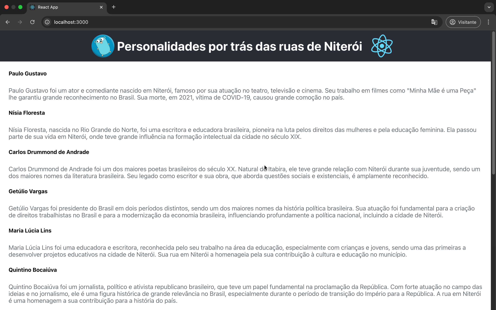
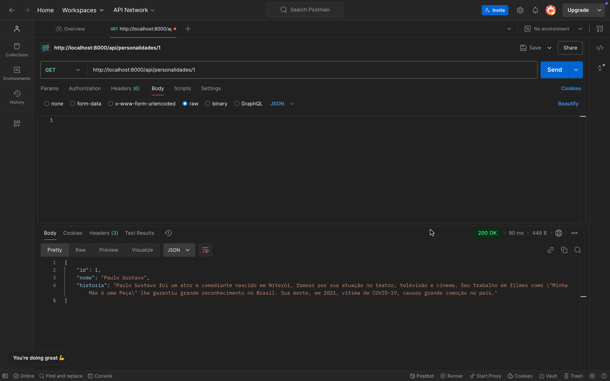

# API Personalidades por trás das ruas de Niterói 🌟

Essa API foi desenvolvida no curso **"Criando uma API Rest em Go" da Alura**, ministrado por **Guilherme Lira**. A aplicação lista personalidades importantes que possuem nomes de ruas na cidade de Niterói, como **Paulo Gustavo**, **Carlos Drummond de Andrade** e **Getúlio Vargas**, entre outros.

## Personalidades 🎭

Aqui estão algumas das personalidades homenageadas pelas ruas de Niterói:

- Paulo Gustavo
- Getúlio Vargas
- Quintino Bocaiúva
- Nóbrega
- Gastão Gonçalves
- Miguel de Frias
- Presidente Backer

## Prints da API 📸

Abaixo, alguns prints da aplicação em funcionamento:

  
*Exemplo da tela principal da API.*

  
*Exemplo da listagem da personalidades/1*

## Como rodar a API no Postman 🖥️

### Passo 1: Abra o Postman
- Se ainda não tem, baixe o [Postman](https://www.postman.com/downloads/) e instale.

### Passo 2: Importar a Coleção ou Criar Requisições Manualmente
- Você pode importar a coleção com os endpoints da API ou criar manualmente as requisições.

#### Endpoints Disponíveis:
1. **GET /personalidades**: Retorna a lista de todas as personalidades cadastradas.
2. **POST /personalidades**: Adiciona uma nova personalidade à lista. No corpo da requisição, envie os dados no formato **JSON**.
3. **PUT /personalidades/{id}**: Atualiza os dados de uma personalidade existente. Você deve substituir `{id}` pelo ID da personalidade que deseja atualizar.
4. **DELETE /personalidades/{id}**: Deleta uma personalidade. Substitua `{id}` pelo ID da personalidade que deseja remover.

### Passo 3: URL para o Postman
Para testar a API, use a URL `http://localhost:8000/personalidades` no Postman. Lembre-se de ajustar a URL conforme a requisição (GET, POST, PUT, DELETE) que você deseja realizar.

## Como Rodar a API em Go

### Passo 1: Clonar o Repositório
Clone o repositório para sua máquina local utilizando o comando:

```
git clone https://github.com/kamillyceppas/go-rest-api/
```
### Passo 2: Navegar até a pasta do projeto
Abra o terminal e vá até a pasta onde o arquivo `main.go` está localizado.

### Passo 3: Executar a API
Para rodar a API, execute o seguinte comando:

```
go run main.go
```
Isso fará com que a API esteja rodando em http://localhost:8000.

## Como Rodar o React no Frontend ⚛️

### Passo 1: Instalar Dependências
Abra o terminal e navegue até a pasta do frontend. Execute o comando para instalar as dependências do React:

```
npm install
```

## Passo 2: Rodar o Frontend
Após a instalação das dependências, execute o comando para rodar o servidor de desenvolvimento:

```
npm start
```
Isso abrirá o React no navegador em `http://localhost:3000` por padrão.


## Contato 📞

Se você tiver alguma dúvida ou sugestão, entre em contato comigo:

**Nome**: Kamilly Ceppas  
**GitHub**: [@kamillyceppas](https://github.com/kamillyceppas)  
**LinkedIn**: [Kamilly Ceppas](https://www.linkedin.com/in/kamillyceppas/)


